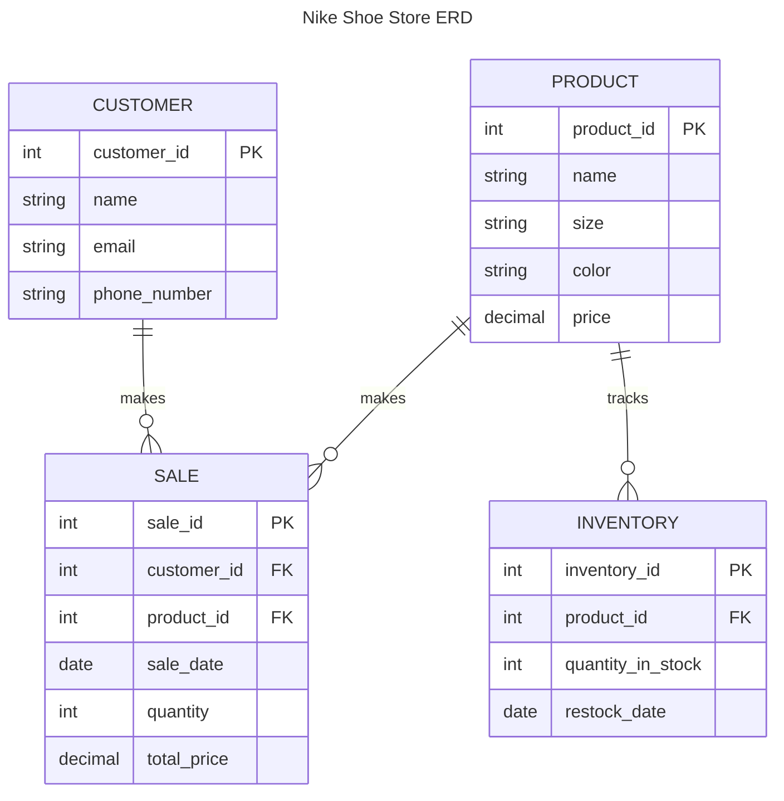

* The relationship between **Poduct** and **Sales**S helps the store see which products are popular, making it easier to decide when to restock or run promotions.
* The link between **Custmurs** and **Sales** lets the store understand what customers like to buy, so they can offer targeted deals and build loyalty.
* The **Poduct** and **Inventory** connection keeps track of stock levels, ensuring there’s enough of each product and preventing shortages or excess.

